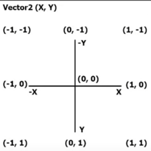

# SpritesheetAnimation001

Spritesheet animation with walking, running, jumping, and attacking animations \
Monogame classes used: ```Vector2```, ```Texture2D```, ```Keyboard```

There is a spritesheet: `knight_spritesheet.png` in the `Content` folder containing 9 animations with 6 frames per animation. Only the first 6 animations are implemented (`Ready`, `Walk`, `Run`, `Attack1`, `Attack2`, and `Jump`)

The animations were created using [Aseprite](https://https://aseprite.org/), along with the spritesheet mentioned above a JSON data file was also created using the Export Sprite Sheet functionality of Aseprite: `knight_spritesheet_array.json`. This file contains the coordinates within the spritesheet image for the individual frames. This json file is consumed by `AnimationManager`

---
### Controls:

| Action      | Key       |
| --------    | -------   |
| Walk left   | A         |
| Walk right  | D         |
| Run         | Shift (hold down while walking)    |
| Jump        | W         |
| Attack 1    | Space     |
| Attack 2    | Left Ctrl |

\
\
Directions:



